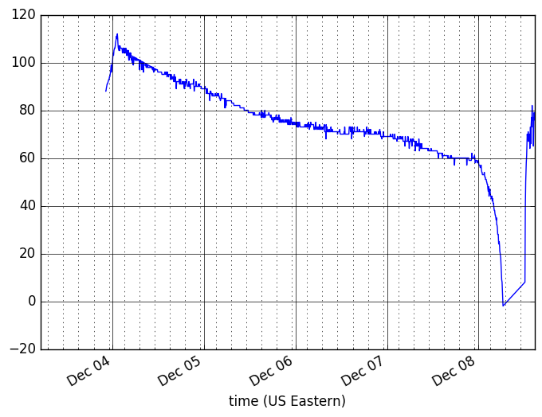

# LiPo batter charge cyle

- battery: 3.7V 530 mAH batter (todo: check capacity when home)
- Adafruit Feather ESP8266

Program wakes every 3 minutes and reports to thingspeak then goes back to deep sleep. It does not try again if error. There is a very small and very very faint LED also being driven (faint as in sometimes can't find it in dark room).

Used voltage divider as in Adafruit tutorial. Measured resistors with meter and they were surprisingly close to nominal values (todo: add circuit) so 100% on chart s/b close to 4.2V.

Started with topping off then removed power while measuring. It ran till it died.

Curious how low the voltage can get here. Adafruit tut indicates battery protection circuit should cut it off around 3.2V, which would be around 81% on our chart (chart maxes at 107%). And regulator has a minimum input of 2.5V which is 63% on chart. This latter is pretty close to where we get our steep drop off. Maybe near threshold we got a few cycles out of the ESP and maybe voltage readings at that point are unreliable as a result of the brownout.

It reported for quite a while before failing to wake.
